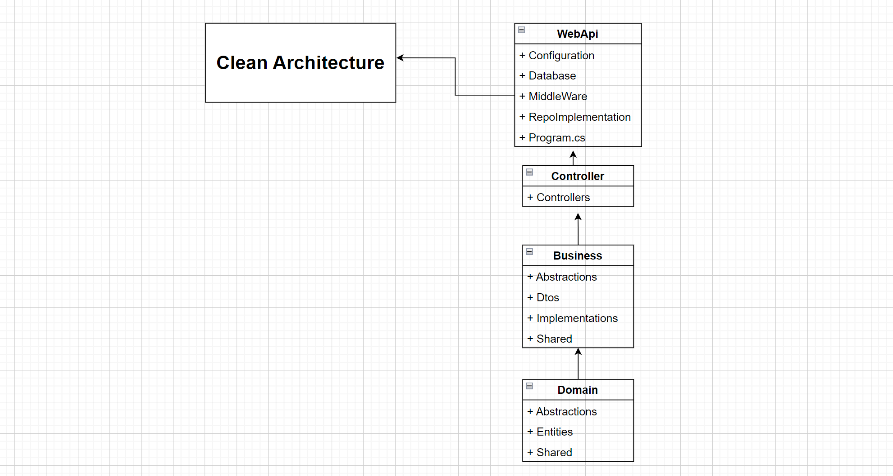
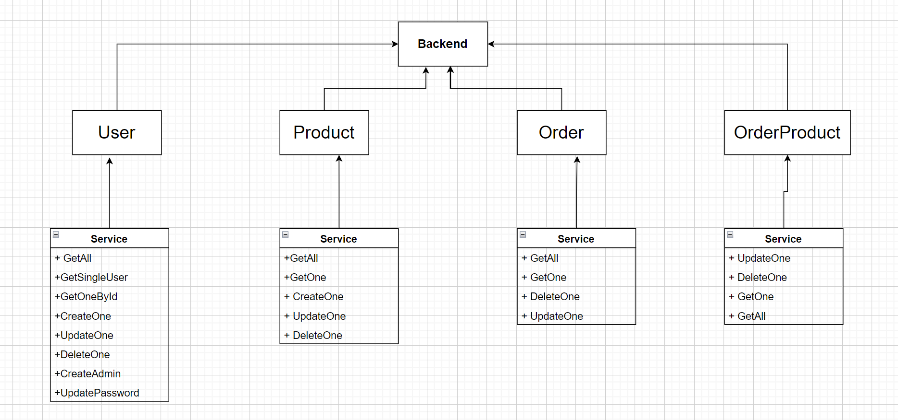
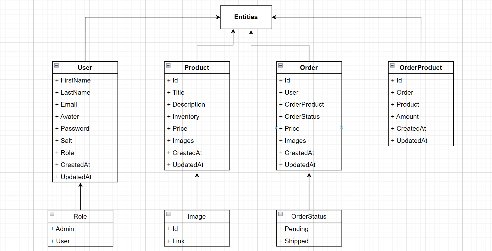

## Description

This is a fullstack project containig both client side and server side. The application is an ecommerce site 
where the server side has been made with ASP.Net Core, client side with ReactJS and PostgreSQL as database.
The server side provides the rest APIs and also connect the database. The frontend as well as client side handles 
the functions of an ecommrce side. 

## Client side technology
1. React
2. Typescript
3. Route
4. Testing
5. Material UI
5. Redux
6. Reducer
7. SASS/SCSS
8. Route protection
9. Custom hooks
10. Components
11. Pagination

## Server side technology
1. ASP.net core
2. C#
3. Clean architecture
4. JWT authentication

## Database technology
1. PostgreSQL

## Feature
1. User authentication
2. Admin specific tasks (add, update, delete a product)
3. Relational Database
4. Dynamic dark theme
5. Adding product in cart and managing quantity
6. Some protected routes
7. Well responsive UI
8. Pagination for product card

## Deployment

Live demo -> "https://alihyva.netlify.app/"

## Clean architecture

## Server routes

## Relational Database

